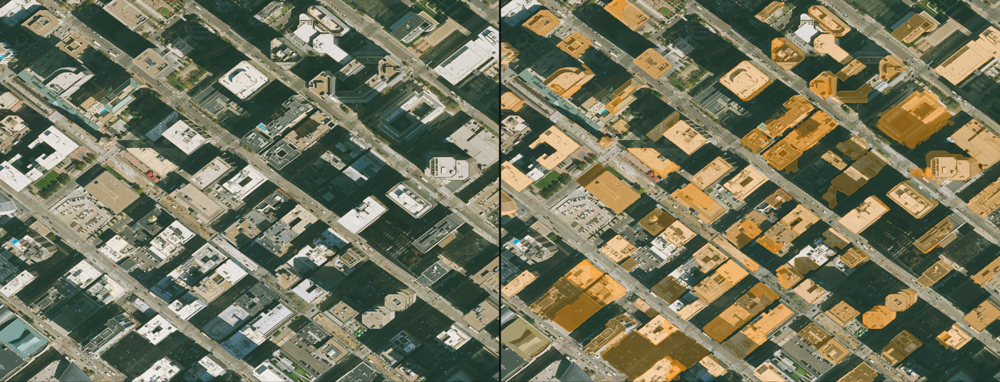
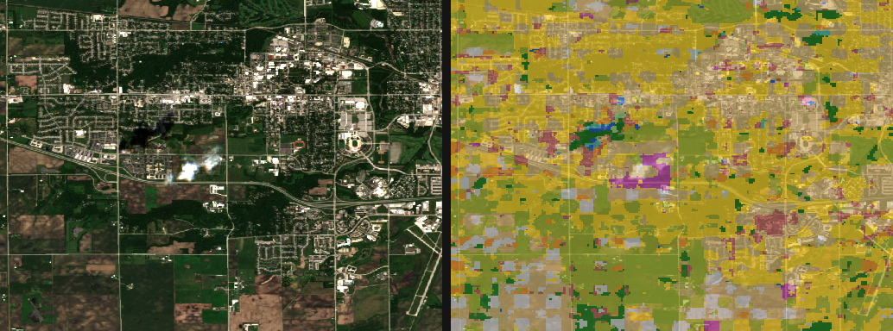

# ML‑Map — Geospatial Foundation Models, Side by Side

An interactive app for applying **geospatial foundation models** to remotely
sensed imagery — **inference only, no training**. Draw an area on the map,
one‑click fetch high‑resolution imagery, run a foundation model, and compare its
output against the raw image **and against real reference data** with hard
metrics.

The point isn't that one model does everything — it's the honest comparison:
**different foundation models excel at different tasks, and some tasks are still
hard zero‑shot.** The app makes that visible and quantifiable.

Example outputs (raw imagery | model annotation):

| Building footprints (DINO+SAM) | Land cover (Prithvi, Iowa) |
|---|---|
|  |  |

_(These are rendered model outputs; add live UI screenshots to `docs/` as desired.)_

---

## What it does

- **Split view** — raw imagery (left) vs. model annotations (right), with synced pan/zoom.
- **Four tasks**, each with a model dropdown to compare checkpoints:
  1. **Building footprints** — SAM "segment‑everything" *vs.* Grounding DINO + SAM
  2. **Roads / lines of communication** — Grounding DINO + SAM
  3. **Land cover** — Prithvi‑EO‑1.0 (13‑class crop/land), multi‑temporal Sentinel‑2
  4. **Text‑prompt segmentation** — open vocabulary: type any object and segment it
- **One‑click AOI ingest** — draw a box → fetch NAIP (0.3 m) or Sentinel‑2 from the Microsoft Planetary Computer.
- **Live progress** — granular status (catalog search → tile download → model load → tiled detect → mask → vectorize).
- **Evaluation** — score predictions against free reference data (OpenStreetMap, ESA WorldCover) with **IoU / precision / recall / F1**, plus a reference overlay (cyan = ground truth, orange = model).

## Results (zero‑shot, example AOIs)

| Task | Model | Reference | Metric |
|------|-------|-----------|--------|
| Buildings | **Grounding DINO + SAM** | OSM footprints | **IoU 0.53 · F1 0.69 · P 0.82 · R 0.60** |
| Buildings | SAM segment‑everything | OSM footprints | IoU 0.41 · F1 0.58 |
| Roads | Grounding DINO + SAM | OSM roads | P 0.66 · **R 0.21** · F1 0.32 |
| Land cover | Prithvi‑EO‑1.0 100M | ESA WorldCover | overall agreement varies by AOI |

**Reading the numbers:**
- **Buildings:** detect‑then‑segment (DINO+SAM) beats segment‑everything‑then‑filter on every metric — a clean, quantified model‑comparison result.
- **Roads:** high precision, low recall — the model finds prominent arterials and rail corridors but misses the residential street grid. Zero‑shot foundation models can't do full road extraction; you'd want a road‑specific model (SpaceNet/DeepGlobe).
- **Land cover:** the CDL‑trained crop model works well over Midwest farmland (sensible corn/soy/wheat) but over‑predicts "cropland" elsewhere — specialist models don't generalize.

## Data & models

| | Source | Resolution | Access |
|---|---|---|---|
| High‑res imagery | **NAIP** (US) | 0.3–1 m | Planetary Computer STAC |
| Multispectral | **Sentinel‑2 L2A** (global) | 10–20 m | Planetary Computer STAC |
| Buildings/roads/text | **SAM**, **Grounding DINO** | — | HuggingFace `transformers` |
| Land cover | **Prithvi‑EO‑1.0‑100M** (crop classification) | — | HuggingFace (mmseg checkpoint, rebuilt in PyTorch) |
| Reference | **OpenStreetMap** (Overpass), **ESA WorldCover** | — | Overpass API / Planetary Computer |

## Architecture

```
React + MapLibre GL (Vite, :5173)            FastAPI (:8077, CUDA)
 ├─ AOI draw → /ingest                  →      ├─ /ingest   NAIP / Sentinel-2 (STAC mosaic, reproject)
 ├─ task ▸ model ▸ prompt → /infer      →      ├─ /infer    SAM · DINO+SAM (tiled) · Prithvi land cover
 ├─ Evaluate → /evaluate                →      ├─ /evaluate OSM / WorldCover → IoU/F1
 ├─ split maps + overlays               ←      ├─ /progress live stage tracker
 └─ progress banner (polls /progress)         └─ model zoo (lazy-loaded, kept warm in 16 GB VRAM)
```

Chips are small per‑AOI, so results are served as MapLibre `ImageSource` raster
overlays (PNG + bounds) and GeoJSON vectors — no tile server needed.

## Notable engineering

- **Ran a legacy model on a modern stack.** The Prithvi land‑cover model ships
  only as an mmsegmentation checkpoint (won't run under torch 2.6). Dissected the
  `.pth` and **rebuilt the exact architecture in plain PyTorch** — the legacy
  weights load with zero missing/unexpected keys.
- **Tiled (SAHI‑style) detection** at full native resolution so Grounding DINO
  (trained on ground‑level photos) finds far more overhead objects (~3× recall).
- **Sentinel‑2 gotcha:** removed the +1000 baseline‑04.00 BOA offset to match the
  reflectance units Prithvi was trained on (without it, every class was wrong).

## Stack

- **Backend:** FastAPI · PyTorch 2.6 (CUDA 12.4) · transformers · terratorch · rasterio/rioxarray/odc‑stac · shapely/geopandas. Python 3.12 (pyenv venv `machine-learning`).
- **Frontend:** React + TypeScript + MapLibre GL (Vite).
- **Hardware:** developed on an RTX 4080 Super (16 GB); all inference local.

## Run (development)

```bash
./run.sh
# backend  → http://127.0.0.1:8077  (FastAPI, docs at /docs)
# frontend → http://127.0.0.1:5173  (open this)
```

The frontend proxies `/api` and `/data` to the backend, so just open the frontend URL.

**Tips:** NAIP is US‑only. Land cover is US‑cropland‑trained — try farmland
(e.g. central Iowa) for sensible results. First run of each model downloads its
weights (the progress banner shows it).

## Build status

- [x] **Phase 0** — backend skeleton + React/MapLibre split view
- [x] **Phase 1** — AOI draw → STAC ingest (NAIP, 0.3 m)
- [x] **Phase 2** — Building footprints (SAM segment‑everything) + model dropdown
- [x] **Phase 3** — Text‑prompt segmentation (Grounding DINO + SAM, tiled)
- [x] **Phase 4** — Roads + Land cover (Sentinel‑2 + Prithvi 13‑class) + live progress UI + full‑res tiling
- [x] **Phase 5** — Model comparison + evaluation vs OSM / ESA WorldCover (IoU/F1) + reference overlay

## Limitations (by design — this is a zero‑shot study)

- NAIP is US‑only; the crop/land model is US‑cropland‑trained.
- Roads are not solved zero‑shot (low recall).
- SAM mask boundaries are limited by its internal 1024 px encoder.
- Reference data is imperfect (OSM completeness varies; WorldCover is 10 m and a
  different taxonomy than the crop model) — metrics are indicative, not absolute.
